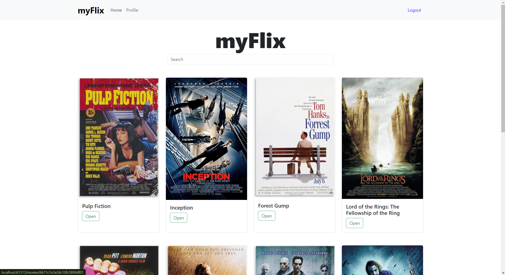

## Table of Contents

- [Overview](#overview)
- [Features](#features)
- [Live Demo](#live-demo)
- [Project Dependencies](#project-dependencies)
- [API Used](#api-used)

## Overview

myFlix-client is a SPA(Single Page Application) for the client side of my myFlix app. It allows uses to browse and search movies, view detailed info about movies, add movies to a list of favorites, and manage profile information. The app was built using React and React-bootstrap.

## Features

**Signup View** allows a user to sign up. Upon sign up the user is redirected to the login view.
**Login View** is where the user signs in and is given a JWT token for requests to the server.
**Main View** allows the user to search/browse movies and click on each for more details in Movie View
**Movie View** shows further details about the movie and allows the user to add it to their list of favorites. It also displays a list of similar movies based on genre.
**Profile View** allows the user to see their current user information and update it if they choose to do so. It also displays their list of favorite movies.
**Navigation Bar** allows the user to go from main view to profile view, as well as, the ability to log out.

## Live Demo

[Click here for the Live Site](https://myflix-crd.netlify.app/)

## Project Dependencies

- React
- React-bootstrap
- React-router
- Bootstrap
- Fetch API for HTTP requests

## API Used

- [myFlix API](https://github.com/CalebRD33/myFlix)